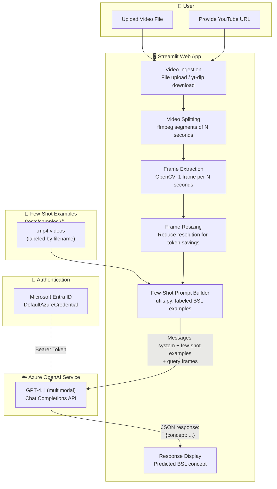

# British Sign Language (BSL) Recognition with Azure OpenAI GPT-4.1

## Objective

This project demonstrates how to use **Azure OpenAI GPT-4.1** multimodal capabilities to **recognize British Sign Language (BSL) concepts from video**, using a **few-shot prompting** approach. The model receives labeled example videos of BSL signs and then identifies the signed concept in new, unseen videos.

The repository includes:

- **Jupyter Notebook** (`aoai-sign-translation.ipynb`): Interactive experimentation for few-shot BSL recognition — load example videos, build few-shot prompts, and evaluate the model's predictions against ground truth.
- **Streamlit Web Application** (`video-analysis-app.py`): A user-friendly web app that lets users upload video files or provide YouTube URLs, and get real-time BSL concept recognition powered by the same few-shot pipeline.

---

## Architecture Diagram



### Components

| Component | Description |
|---|---|
| **Streamlit Web App** | Interactive UI for uploading videos, configuring parameters, and viewing results. |
| **Video Ingestion** | Accepts local file uploads (.mp4, .avi, .mov) or YouTube URLs via `yt-dlp`. |
| **Video Splitting** | Uses `ffmpeg` to split long videos into segments of configurable duration. |
| **Frame Extraction** | Uses OpenCV to extract frames at a configurable rate (default: 1 frame/second). Each frame is timestamped. |
| **Frame Resizing** | Reduces frame resolution to save tokens and improve latency. |
| **Few-Shot Prompt Builder** (`utils.py`) | Loads labeled BSL example videos from disk, extracts their frames, and builds a few-shot message sequence (system prompt + example user/assistant turns). |
| **VideoFTTools** (`VideoFTTools.py`) | Utility class for video frame extraction, display, and dataset management. |
| **Azure OpenAI GPT-4.1** | Multimodal model that receives the few-shot examples and query frames, and returns the predicted BSL concept as JSON. |
| **Microsoft Entra ID** | Authentication via `DefaultAzureCredential` with bearer token provider — no API keys required. |

---

## How It Works — Step by Step

### Notebook: `aoai-sign-translation.ipynb`

1. **Setup & Configuration** — Load environment variables, initialize the Azure OpenAI client with Entra ID authentication, and configure dataset parameters (number of frames, classes, seeds).
2. **Load Few-Shot Examples** — Read labeled BSL video samples from `tests/samples/`. Each `.mp4` filename encodes the BSL concept label (e.g., `good_morning.mp4` → "good morning").
3. **Extract & Encode Frames** — Use `VideoExtractor` to extract N frames per video, optionally resize them, and encode as base64 JPEG.
4. **Build Few-Shot Prompt** — Construct a message sequence: a system prompt describing the task and possible labels, followed by user/assistant turns for each labeled example.
5. **Inference on Test Video** — Extract frames from a test video (e.g., `tests/good_morning_test.mp4`), append them as a new user message, and call Azure OpenAI GPT-4.1.
6. **Evaluate Results** — Compare the predicted concept against the ground truth and display the extracted frames for visual verification.

### Application: `video-analysis-app.py`

1. **Launch the App** — The Streamlit app starts and pre-loads few-shot examples from `tests/samples2/` (cached for performance).
2. **Select Video Source** — The user chooses to upload a local video file or provide a YouTube URL.
3. **Configure Parameters** — Via the sidebar: segment duration, frame extraction rate, resize ratio, temperature, and prompts.
4. **Video Splitting** — The video is split into segments of N seconds using `ffmpeg` for efficient processing.
5. **Frame Extraction** — For each segment, frames are extracted at the configured rate using OpenCV and encoded as base64.
6. **Model Analysis** — The few-shot messages (system + examples) are combined with the query frames and sent to Azure OpenAI GPT-4.1.
7. **Display Results** — The predicted BSL concept is displayed alongside the video segment in the UI.

---

## Prerequisites

+ An Azure subscription with [access to Azure OpenAI](https://aka.ms/oai/access).
+ An **Azure OpenAI** resource with a **GPT-4.1** model deployment.
+ **Microsoft Entra ID** credentials configured (the project uses `DefaultAzureCredential` — no API keys needed).
+ **ffmpeg** installed and available in PATH (for video splitting).
+ Python 3.10 or later.

## Setup

### 1. Set up a Python virtual environment

1. Open the Command Palette (Ctrl+Shift+P).
2. Search for **Python: Create Environment**.
3. Select **Venv**.
4. Select a Python interpreter (3.10 or later).

If you run into problems, see [Python environments in VS Code](https://code.visualstudio.com/docs/python/environments).

### 2. Install dependencies

```bash
pip install -r requirements.txt
```

The required libraries are specified in [requirements.txt](requirements.txt).

### 3. Configure environment variables

Copy `env.template` to `.env` and fill in your values:

```bash
cp env.template .env
```

| Variable | Description |
|---|---|
| `AZURE_OPENAI_ENDPOINT` | Your Azure OpenAI resource endpoint |
| `AZURE_OPENAI_DEPLOYMENT` | Name of your Azure OpenAI model deployment |

### 4. Run the Streamlit application

```bash
streamlit run video-analysis-app.py
```

### 5. Run the Jupyter Notebook

Open `aoai-sign-translation.ipynb` in VS Code with the [Jupyter extension](https://marketplace.visualstudio.com/items?itemName=ms-toolsai.jupyter) and run the cells sequentially.

---

## Project Structure

```
├── video-analysis-app.py          # Streamlit web application for BSL recognition
├── aoai-sign-translation.ipynb    # Jupyter notebook for experimentation
├── utils.py                       # Few-shot prompt builder utilities
├── VideoFTTools.py                # Video extraction, dataset helpers, evaluation tools
├── call_aoai.py                   # Standalone Azure OpenAI call utility
├── requirements.txt               # Python dependencies
├── env.template                   # Environment variables template
├── tests/
    └── samples/                   # Few-shot example videos (for notebook)

```
