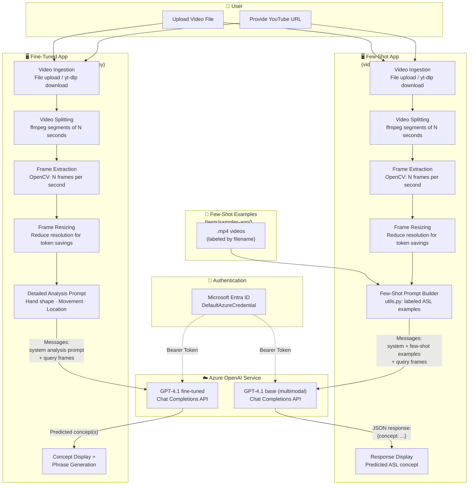

# American Sign Language (ASL) Recognition with Azure OpenAI GPT-4.1

## Objective

This project demonstrates how to use **Azure OpenAI GPT-4.1** multimodal capabilities to **recognize American Sign Language (ASL) concepts from video**, using a **few-shot prompting** approach. The model receives labeled example videos of ASL signs and then identifies the signed concept in new, unseen videos.

The repository includes:

- **Jupyter Notebook** (`aoai-sign-translation.ipynb`): Interactive experimentation for few-shot ASL recognition — load example videos, build few-shot prompts, and evaluate the model's predictions against ground truth.
- **Jupyter Notebook** (`sign_language_fine_tuning.ipynb`): End-to-end vision fine-tuning pipeline for sign language recognition (ASL/DGS) with Azure OpenAI GPT-4.1 — includes video download and validation, concept-group selection, frame extraction, JSONL dataset creation, SFT training, and base-vs-fine-tuned evaluation.
- **Few-Shot Video Analysis Streamlit Web Application** (`video-analysis-few-shots-app.py`): A user-friendly web app that lets users upload video files or provide YouTube URLs, and get real-time ASL concept recognition powered by the few-shot pipeline.
- **Fine-Tuned Video Analysis Streamlit Web Application** (`video-analysis-fine-tuned-app.py`): A Streamlit web app that uses a **fine-tuned GPT-4.1 model** (no few-shot examples needed) to recognize ASL concepts from uploaded videos or YouTube URLs. It splits videos into segments, extracts frames, sends them to the fine-tuned model with a detailed analysis prompt, and generates a natural English phrase from the sequence of identified concepts.

---

## Architecture Diagram


```mermaid
flowchart TB
    subgraph User["👤 User"]
        A1[Upload Video File]
        A2[Provide YouTube URL]
    end

    subgraph FewShotApp["🖥️ Few-Shot App<br/>(video-analysis-few-shots-app.py)"]
        B1[Video Ingestion<br/>File upload / yt-dlp download]
        B2[Video Splitting<br/>ffmpeg segments of N seconds]
        B3[Frame Extraction<br/>OpenCV: N frames per second]
        B4[Frame Resizing<br/>Reduce resolution for token savings]
        B5[Few-Shot Prompt Builder<br/>utils.py: labeled ASL examples]
        B6[Response Display<br/>Predicted ASL concept]
    end

    subgraph FineTunedApp["🖥️ Fine-Tuned App<br/>(video-analysis-fine-tuned-app.py)"]
        F1[Video Ingestion<br/>File upload / yt-dlp download]
        F2[Video Splitting<br/>ffmpeg segments of N seconds]
        F3[Frame Extraction<br/>OpenCV: N frames per second]
        F4[Frame Resizing<br/>Reduce resolution for token savings]
        F5[Detailed Analysis Prompt<br/>Hand shape · Movement · Location]
        F6[Concept Display +<br/>Phrase Generation]
    end

    subgraph FewShot["📂 Few-Shot Examples<br/>(tests/samples-app/)"]
        C1[".mp4 videos<br/>(labeled by filename)"]
    end

    subgraph AzureOpenAI["☁️ Azure OpenAI Service"]
        D1["GPT-4.1 base (multimodal)<br/>Chat Completions API"]
        D2["GPT-4.1 fine-tuned<br/>Chat Completions API"]
    end

    subgraph Auth["🔐 Authentication"]
        E1[Microsoft Entra ID<br/>DefaultAzureCredential]
    end

    A1 --> B1
    A2 --> B1
    A1 --> F1
    A2 --> F1
    B1 --> B2
    B2 --> B3
    B3 --> B4
    C1 --> B5
    B4 --> B5
    B5 -->|"Messages:<br/>system + few-shot examples<br/>+ query frames"| D1
    E1 -.->|Bearer Token| D1
    E1 -.->|Bearer Token| D2
    D1 -->|"JSON response:<br/>{concept: ...}"| B6
    F1 --> F2
    F2 --> F3
    F3 --> F4
    F4 --> F5
    F5 -->|"Messages:<br/>system analysis prompt<br/>+ query frames"| D2
    D2 -->|"Predicted concept(s)"| F6
```

### Components

| Component | Description |
|---|---|
| **Few-Shot Streamlit App** | Interactive UI for uploading videos, configuring parameters, and viewing results using few-shot prompting with labeled examples. |
| **Fine-Tuned Streamlit App** | Interactive UI that uses a fine-tuned GPT-4.1 model — no example videos needed. Includes phrase generation from identified concepts. |
| **Video Ingestion** | Accepts local file uploads (.mp4, .avi, .mov) or YouTube URLs via `yt-dlp`. |
| **Video Splitting** | Uses `ffmpeg` to split long videos into segments of configurable duration. |
| **Frame Extraction** | Uses OpenCV to extract frames at a configurable rate (default: 1-4 frames/second). Each frame is timestamped. |
| **Frame Resizing** | Reduces frame resolution to save tokens and improve latency. |
| **Few-Shot Prompt Builder** (`utils.py`) | Loads labeled ASL example videos from disk, extracts their frames, and builds a few-shot message sequence (system prompt + example user/assistant turns). Used by the few-shot app only. |
| **VideoFTTools** (`VideoFTTools.py`) | Utility class for video frame extraction, display, and dataset management. |
| **Azure OpenAI GPT-4.1** | Base multimodal model (few-shot app) or fine-tuned model (fine-tuned app) that receives frames and returns predicted ASL concepts. |
| **Phrase Generation** | The fine-tuned app sends the ordered list of recognized concepts to GPT-4.1 to compose the most likely natural English sentence. |
| **Microsoft Entra ID** | Authentication via `DefaultAzureCredential` with bearer token provider — no API keys required. |

---

## How It Works — Step by Step

### Notebook: `aoai-sign-translation.ipynb`

1. **Setup & Configuration** — Load environment variables, initialize the Azure OpenAI client with Entra ID authentication, and configure dataset parameters (number of frames, classes, seeds).
2. **Load Few-Shot Examples** — Read labeled ASL video samples from `tests/samples/`. Each `.mp4` filename encodes the ASL concept label (e.g., `good_morning.mp4` → "good morning").
3. **Extract & Encode Frames** — Use `VideoExtractor` to extract N frames per video, optionally resize them, and encode as base64 JPEG.
4. **Build Few-Shot Prompt** — Construct a message sequence: a system prompt describing the task and possible labels, followed by user/assistant turns for each labeled example.
5. **Inference on Test Video** — Extract frames from a test video (e.g., `tests/good_morning_test.mp4`), append them as a new user message, and call Azure OpenAI GPT-4.1.
6. **Evaluate Results** — Compare the predicted concept against the ground truth and display the extracted frames for visual verification.

### Notebook: `sign_language_fine_tuning.ipynb`

1. **Dataset Acquisition** — Download and organize sign language clips from WLASL (ASL) and/or DGS sources.
2. **Data Quality & Selection** — Run integrity checks to remove corrupt videos and select balanced concept groups for training.
3. **Frame Preparation** — Extract and validate frames (format, size, color mode), then encode them for multimodal training.
4. **JSONL Construction** — Build train/validation JSONL files with prompts and base64-encoded image content.
5. **Fine-Tuning Job** — Upload files to Azure OpenAI and launch an SFT fine-tuning job on GPT-4.1 with configurable hyperparameters.
6. **Monitoring & Analysis** — Track training events and metrics, analyze overfitting risk, and identify recommended checkpoints.
7. **Evaluation** — Compare base vs fine-tuned model performance using accuracy/precision/recall views and confusion-matrix analysis.
8. **Incremental Workflow** — Support multi-group/incremental fine-tuning and ad-hoc inference on arbitrary frame sequences.

### Application: `video-analysis-few-shots-app.py`

1. **Launch the App** — The Streamlit app starts and pre-loads few-shot examples from `tests/samples-app/` (cached for performance).
2. **Select Video Source** — The user chooses to upload a local video file or provide a YouTube URL.
3. **Configure Parameters** — Via the sidebar: segment duration, frame extraction rate, resize ratio, temperature, and prompts.
4. **Video Splitting** — The video is split into segments of N seconds using `ffmpeg` for efficient processing.
5. **Frame Extraction** — For each segment, frames are extracted at the configured rate using OpenCV and encoded as base64.
6. **Model Analysis** — The few-shot messages (system + examples) are combined with the query frames and sent to Azure OpenAI GPT-4.1.
7. **Display Results** — The predicted ASL concept is displayed alongside the video segment in the UI.

### Application: `video-analysis-fine-tuned-app.py`

1. **Launch the App** — The Streamlit app starts with a detailed ASL analysis system prompt (no few-shot examples required).
2. **Select Video Source** — The user chooses to upload a local video file or provide a YouTube URL.
3. **Configure Parameters** — Via the sidebar: segment duration (default 2s), frame extraction rate (default 4 fps), resize ratio, temperature, and prompts.
4. **Video Splitting** — The video is split into short segments using `ffmpeg` for efficient per-sign processing.
5. **Frame Extraction** — For each segment, frames are extracted at the configured rate using OpenCV and encoded as base64.
6. **Fine-Tuned Model Analysis** — Frames are sent to the fine-tuned GPT-4.1 model with a structured system prompt that guides the model through hand shape, movement trajectory, location, facial expression, and transition analysis.
7. **Concept Identification** — The fine-tuned model returns the recognized ASL concept(s) from a vocabulary of 30 signs.
8. **Phrase Generation** — After all segments are processed, the identified concepts are sent to the model to compose a natural English sentence representing what the signer communicated.

---

## Prerequisites

+ An Azure subscription with [access to Azure OpenAI](https://aka.ms/oai/access).
+ An **Azure OpenAI** resource with a **GPT-4.1** model deployment.
+ **Microsoft Entra ID** credentials configured (the project uses `DefaultAzureCredential` — no API keys needed).
+ **ffmpeg** installed and available in PATH (for video splitting).
+ Python 3.10 or later.

## Setup

### 1. Set up a Python virtual environment

1. Open the Command Palette (Ctrl+Shift+P).
2. Search for **Python: Create Environment**.
3. Select **Venv**.
4. Select a Python interpreter (3.10 or later).

If you run into problems, see [Python environments in VS Code](https://code.visualstudio.com/docs/python/environments).

### 2. Install dependencies

```bash
pip install -r requirements.txt
```

The required libraries are specified in [requirements.txt](requirements.txt).

### 3. Configure environment variables

Copy `env.template` to `.env` and fill in your values:

```bash
cp env.template .env
```

| Variable | Description |
|---|---|
| `AZURE_OPENAI_ENDPOINT` | Your Azure OpenAI resource endpoint |
| `AZURE_OPENAI_DEPLOYMENT` | Name of your Azure OpenAI model deployment |

### 4. Run the Streamlit application

```bash
# Few-shot app (uses labeled example videos)
streamlit run video-analysis-few-shots-app.py

# Fine-tuned model app (no few-shot examples needed)
streamlit run video-analysis-fine-tuned-app.py
```

### 5. Run the Jupyter Notebook

Open `aoai-sign-translation.ipynb` or `sign_language_fine_tuning.ipynb` in VS Code with the [Jupyter extension](https://marketplace.visualstudio.com/items?itemName=ms-toolsai.jupyter) and run the cells sequentially.

---

## Project Structure

```
├── video-analysis-few-shots-app.py     # Streamlit app: few-shot ASL recognition
├── video-analysis-fine-tuned-app.py    # Streamlit app: fine-tuned model ASL recognition
├── aoai-sign-translation.ipynb         # Jupyter notebook for experimentation
├── sign_language_fine_tuning.ipynb     # End-to-end vision fine-tuning notebook
├── utils.py                            # Few-shot prompt builder utilities
├── VideoFTTools.py                     # Video extraction, dataset helpers, evaluation tools
├── requirements.txt                    # Python dependencies
├── env.template                        # Environment variables template
└── tests/
    ├── samples-nb/                     # Few-shot example videos (for notebook)
    └── samples-app/                    # Few-shot example videos (for app)
```
